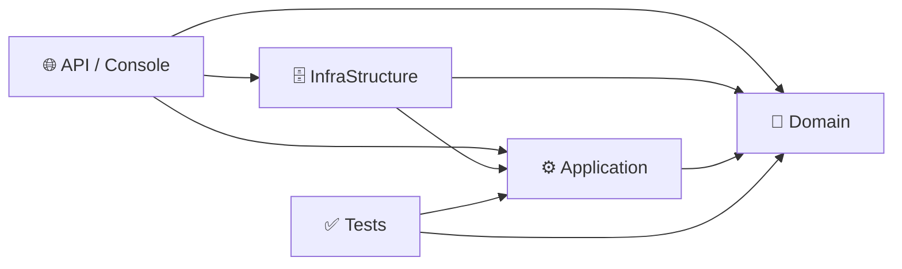

<div align="center">

# 🏗️ Arch Gen

**Gerador de soluções C# em Clean Architecture, ele mesmo construído em Clean Architecture.**

[](https://dotnet.microsoft.com/)
[](https://learn.microsoft.com/dotnet/csharp/)
[](https://learn.microsoft.com/ef/core/)

[](#-status-atual-e-limitações-conhecidas)
[](#-licença)
[](#-contribuindo)

</div>

---

Gerador de scaffolding que cria, via `dotnet`, a base inicial de uma solução C# organizada em camadas (Clean Architecture).

O objetivo é eliminar o trabalho manual repetitivo de montar Domain, Application, Infrastructure, Tests e a camada de apresentação (API ou Console) toda vez que um projeto novo começa — deixando a solução pronta para receber regra de negócio desde o primeiro commit.

> 💡 **Dogfooding**: o próprio Arch Gen é uma aplicação C# construída seguindo a mesma Clean Architecture que ele gera para o usuário — Domain, Application e Infrastructure separados, com persistência própria em SQLite.

## 📑 Índice

- [Visão geral](#-visão-geral)
- [Estrutura gerada](#-estrutura-gerada)
- [Como usar](#-como-usar)
- [Requisitos](#-requisitos)
- [Como o Arch Gen funciona por dentro](#-como-o-arch-gen-funciona-por-dentro)
- [Persistência](#-persistência)
- [Status atual e limitações conhecidas](#-status-atual-e-limitações-conhecidas)
- [Roadmap](#-roadmap)
- [Contribuindo](#-contribuindo)
- [Licença](#-licença)

## 🔎 Visão geral

O Arch Gen nasceu como um script Python de scaffolding e foi reescrito do zero em **C#**, seguindo Clean Architecture — a mesma estrutura que ele entrega para os projetos gerados. Ele orquestra chamadas ao `dotnet` CLI, organiza pastas, escreve arquivos-base, conecta referências entre projetos e monta a `.sln`, tudo a partir de um único comando.

A ideia não é substituir a evolução manual do código C# gerado: é acelerar a largada. Depois que o Arch Gen termina, o projeto criado passa a ser a fonte da verdade; o Arch Gen só cuida do início — e agora também lembra o que já gerou.

## 📁 Estrutura gerada

Dependendo do modo escolhido (`API` ou `CONSOLE`), o Arch Gen monta uma solução com os seguintes projetos:

| Projeto | Responsabilidade |
|---|---|
| 🧠 `NomeDoProjeto.Domain` | Entidades, regras de negócio, interfaces de domínio, exceções |
| ⚙️ `NomeDoProjeto.Application` | Casos de uso, DTOs, contratos da aplicação |
| 🗄️ `NomeDoProjeto.InfraStructure` | `DbContext`, repositórios, integrações técnicas (EF Core, SQLite) |
| 🌐 `NomeDoProjeto.API` *(modo API)* | Endpoints HTTP, Swagger, injeção de dependência |
| 💻 `NomeDoProjeto.Console` *(modo Console)* | Execução por linha de comando |
| ✅ `NomeDoProjeto.Tests` | Testes unitários, organizados por camada |

As referências entre projetos já saem conectadas respeitando a regra de dependência da Clean Architecture — nada aponta para fora do seu próprio nível:



## 🚀 Como usar

```bash
dotnet run --project ArchGen.Console -- <NomeDoProjeto> <API|CONSOLE>
```

Com caminho de destino customizado (por padrão, usa o diretório atual):

```bash
dotnet run --project ArchGen.Console -- <NomeDoProjeto> <API|CONSOLE> <CaminhoDestino>
```

**Exemplos:**

```bash
dotnet run --project ArchGen.Console -- ArchGenDemo API
dotnet run --project ArchGen.Console -- ArchGenDemo CONSOLE C:\Projetos\ArchGenDemo
```

> 💡 Se o projeto já existir no caminho informado, o Arch Gen pula a etapa e avisa no terminal, em vez de sobrescrever.

## 📋 Requisitos

| Ferramenta | Uso |
|---|---|
| 🔷 [.NET SDK 8.0](https://dotnet.microsoft.com/download) | Compila e executa o próprio Arch Gen, além de montar os projetos gerados (`dotnet new`, `dotnet add`) |
| 🧰 [dotnet-ef](https://learn.microsoft.com/ef/core/cli/dotnet) | Rotinas de migration do EF Core, tanto do Arch Gen quanto dos projetos gerados |
| 🌐 Internet | Restaura pacotes NuGet (EF Core, SQLite) na primeira execução |

## ⚙️ Como o Arch Gen funciona por dentro

### Arquitetura própria

```
ArchGen.Domain/          → entidades e exceções de domínio
ArchGen.Application/     → orquestração (ArchGenService) e contratos
ArchGen.InfraStructure/  → ITerminalService, IFileArchService, AppDbContext
ArchGen.Console/         → ponto de entrada, leitura de argumentos
```

### `ArchGenService` — orquestrador central

Coordena a geração de cada camada em sequência, respeitando a Dependency Rule (de dentro para fora):

1. Gera `Domain`
2. Gera `Application`
3. Gera `InfraStructure`
4. Gera `API` ou `Console`, conforme o tipo escolhido
5. Gera `Tests` *(em desenvolvimento)*
6. Monta a `.sln` e conecta todas as referências

### Serviços internos

| Serviço | Função |
|---|---|
| `ITerminalService` | Abstrai a execução de comandos externos (`dotnet new`, `dotnet add`), capturando saída e erro |
| `IFileArchService` | Centraliza os caminhos de cada arquivo/pasta gerado e escreve o conteúdo inicial de cada camada |

### O que cada camada recebe de conteúdo inicial

- **Domain** — entidade `User`, `DomainException`/`ApplicationException`/`InfraStructureException`, interface `IUserRepository`, enum `OptionsStatusUsuario`
- **Application** — DTOs de criação/atualização/patch de usuário, `IUserUseCase`, `UserUseCase`
- **InfraStructure** — `AppDbContext`, `UserRepository`, pacote `Microsoft.EntityFrameworkCore` + SQLite já referenciados
- **API** — `Program.cs` configurado com Swagger e `DbContext`, `UserController`
- **Console** — projeto base com pacotes de EF Core/SQLite já adicionados, pronto para receber a lógica de orquestração

## 🗄️ Persistência

O Arch Gen usa **SQLite via EF Core** para lembrar o que já foi gerado, guardando por execução:

| Campo | Descrição |
|---|---|
| `NomeDoProjeto` | Nome informado na geração |
| `PathDoProjeto` | Caminho de destino usado |
| `TipoProjeto` | `API` ou `CONSOLE` |

Isso permite que o Arch Gen reconheça gerações anteriores e evolua, no futuro, para listar histórico e evitar retrabalho em execuções repetidas no mesmo diretório.

## 🐛 Status atual e limitações conhecidas

Sendo transparente sobre o estado real do projeto, para quem for usar ou contribuir:

| Situação | Descrição |
|---|---|
| ✅ Reescrito em C# com Clean Architecture | O orquestrador deixou de ser um script Python e passou a ser uma aplicação C# própria, seguindo a mesma arquitetura que gera. |
| ✅ Namespace dinâmico | Os arquivos gerados usam o nome do projeto para compor `namespace` e `using`, sem acoplamento fixo. |
| ✅ Persistência funcional | `NomeDoProjeto`, `PathDoProjeto` e `TipoProjeto` já são salvos via SQLite/EF Core. |
| 🚧 Testes do Arch Gen ainda não implementados | A camada `Tests` do próprio Arch Gen (não a dos projetos gerados) ainda está pendente — é o item mais próximo de conclusão agora. |
| 🚧 Modo `CONSOLE` gerado incompleto | Cria o projeto e adiciona os pacotes de EF Core/SQLite, mas ainda não escreve o `Program.cs` de orquestração como o modo API já faz. |
| ⚠️ Sem validação de entrada | Nomes de projeto com espaço, caractere inválido, ou tipo diferente de `API`/`CONSOLE` não são tratados hoje. |
| ⚠️ Erros do `dotnet` CLI não interrompem o fluxo | Aparecem no terminal, mas o processo segue para as próximas etapas em vez de parar — facilita continuar manualmente depois, mas ainda não reporta de forma estruturada. |

## 🗺️ Roadmap

- [ ] Escrever os testes do próprio Arch Gen (Domain e Application)
- [ ] Completar o modo `CONSOLE` gerado com um `Program.cs` de orquestração equivalente ao da API
- [ ] Adicionar validação de entrada (nome, tipo, caminho) antes de iniciar qualquer criação
- [ ] Melhorar o tratamento de erro do `dotnet` CLI, interrompendo o fluxo de forma clara quando um passo crítico falhar
- [ ] Extrair os templates de arquivo (hoje como string interpolada) para arquivos `.template` separados
- [ ] Expor histórico de gerações a partir dos dados já persistidos em SQLite
- [ ] Documentar o projeto C# gerado quando ele se tornar a entrega principal do ecossistema

## 🤝 Contribuindo

Contribuições são bem-vindas. Ao propor mudança, mantenha:

- ✅ previsibilidade da estrutura gerada — quem já usou uma vez não deve levar susto na próxima;
- ✅ nomes e convenções consistentes entre as camadas;
- ✅ baixo acoplamento entre os serviços internos do Arch Gen;
- ✅ clareza na separação entre Domain, Application e Infrastructure, tanto no Arch Gen quanto no que ele gera.

## 📄 Licença

*Código autorizado para uso livre.*

---

<div align="center">

Feito por **Darwin** — construído aprendendo, quebrando e corrigindo. 🚀

</div>
