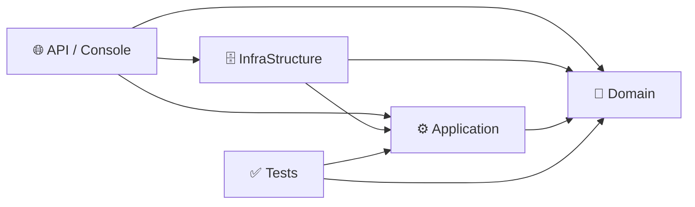

<div align="center">

# 🏗️ Arch Gen

**Scaffolding automatizado para soluções C# em Clean Architecture, gerado via Python.**

[](https://www.python.org/)
[](https://dotnet.microsoft.com/)
[](https://learn.microsoft.com/dotnet/csharp/)
[](https://learn.microsoft.com/ef/core/)

[](#-status-atual-e-limitações-conhecidas)
[](#-licença)
[](#-contribuindo)

</div>

---

Gerador de scaffolding em Python que cria, via `dotnet`, a base inicial de uma solução C# organizada em camadas (Clean Architecture).

O objetivo é eliminar o trabalho manual repetitivo de montar Domain, Application, Infrastructure, Tests e a camada de apresentação (API ou Console) toda vez que um projeto novo começa — deixando a solução pronta para receber regra de negócio desde o primeiro commit.

## 📑 Índice

- [Visão geral](#-visão-geral)
- [Estrutura gerada](#-estrutura-gerada)
- [Como usar](#-como-usar)
- [Requisitos](#-requisitos)
- [Como o gerador funciona por dentro](#-como-o-gerador-funciona-por-dentro)
- [Status atual e limitações conhecidas](#-status-atual-e-limitações-conhecidas)
- [Roadmap](#-roadmap)
- [Contribuindo](#-contribuindo)
- [Licença](#-licença)

## 🔎 Visão geral

Hoje o repositório contém um único script Python (`gerador.py`) que atua como orquestrador de scaffolding: ele chama `dotnet new`, organiza pastas, escreve arquivos-base, conecta referências entre projetos e monta a `.sln` — tudo a partir de um comando só.

A ideia não é substituir a evolução manual do código C#: é acelerar a largada. Depois que o gerador termina, o projeto C# passa a ser a fonte da verdade; o Python só cuida do início.

## 📁 Estrutura gerada

Dependendo do modo escolhido (`API` ou `CONSOLE`), o gerador monta uma solução com os seguintes projetos:

| Projeto | Responsabilidade |
|---|---|
| 🧠 `NomeDoProjeto.Domain` | Entidades, regras de negócio, interfaces de domínio, exceções |
| ⚙️ `NomeDoProjeto.Application` | Casos de uso, DTOs, contratos da aplicação |
| 🗄️ `NomeDoProjeto.InfraStructure` | `DbContext`, repositórios, integrações técnicas (EF Core, SQLite) |
| 🌐 `NomeDoProjeto.API` *(modo API)* | Endpoints HTTP, Swagger, injeção de dependência |
| 💻 `NomeDoProjeto.Console` *(modo Console)* | Execução por linha de comando |
| ✅ `NomeDoProjeto.Tests` | Testes unitários, organizados por camada |

As referências entre projetos já saem conectadas respeitando a regra de dependência da Clean Architecture — nada aponta para fora do seu próprio nível:



## 🚀 Como usar

```bash
python gerador.py <NomeDoProjeto> <API|CONSOLE>
```

Com caminho de destino customizado (por padrão, usa o diretório atual):

```bash
python gerador.py <NomeDoProjeto> <API|CONSOLE> <CaminhoDestino>
```

**Exemplos:**

```bash
python gerador.py ArchGenDemo API
python gerador.py ArchGenDemo CONSOLE C:\Projetos\ArchGenDemo
```

> 💡 Se o projeto já existir no caminho informado, o gerador pula a etapa e avisa no terminal, em vez de sobrescrever.

## 📋 Requisitos

| Ferramenta | Uso |
|---|---|
| 🐍 Python 3.10+ | Executa o gerador |
| 🔷 [.NET SDK](https://dotnet.microsoft.com/download) | Compila e monta os projetos (`dotnet new`, `dotnet add`) |
| 🧰 [dotnet-ef](https://learn.microsoft.com/ef/core/cli/dotnet) | Rotinas de migration do EF Core |
| 🌐 Internet | Restaura pacotes NuGet (EF Core, SQLite) na primeira execução |

## ⚙️ Como o gerador funciona por dentro

### `Program` (classe principal)

Recebe três parâmetros:

- `NomePrograma` — nome-base da solução e de cada projeto gerado
- `TipoPrograma` — `"API"` ou `"CONSOLE"`
- `PathPrograma` — diretório de destino (usa o diretório atual se omitido)

### `Main()`

Executa o fluxo na ordem que respeita a Dependency Rule — de dentro para fora:

1. `Criando_Domain()`
2. `Criando_Application()`
3. `Criando_InfraStrutura()`
4. `Criando_API()` ou `Criando_CONSOLE()`, conforme o tipo escolhido
5. `Criando_Tests()`
6. `Criando_Solucao()` — monta a `.sln` e conecta todas as referências

### Métodos auxiliares

| Método | Função |
|---|---|
| `CriandoClassesCS()` | Gera arquivo de classe/interface/enum via `dotnet new` |
| `ModificandoArquivos()` | Sobrescreve o conteúdo de um arquivo já existente |

### O que cada camada recebe de conteúdo inicial

- **Domain** — entidade `User`, `DomainException`/`ApplicationException`/`InfraStructureException`, interface `IUserRepository`, enum `OptionsStatusUsuario`
- **Application** — DTOs de criação/atualização/patch de usuário, `IUserUseCase`, `UserUseCase`
- **InfraStructure** — `AppDbContext`, `UserRepository`, pacote `Microsoft.EntityFrameworkCore` + SQLite já referenciados
- **API** — `Program.cs` configurado com Swagger e `DbContext`, `UserController`
- **Console** — projeto base com pacotes de EF Core/SQLite já adicionados, pronto para receber a lógica de orquestração

## 🐛 Status atual e limitações conhecidas

Sendo transparente sobre o estado real do projeto, para quem for usar ou contribuir:

| Situação | Descrição |
|---|---|
| ✅ Namespace dinâmico | Os arquivos gerados já usam `NomePrograma` para compor `namespace` e `using`, reduzindo o acoplamento fixo.|
| 🚧 Modo `CONSOLE` incompleto | Cria o projeto e adiciona os pacotes de EF Core/SQLite, mas ainda não escreve o `Program.cs` de orquestração como o modo API já faz. |
| ⚠️ Sem validação de entrada | Nomes de projeto com espaço, caractere inválido, ou tipo diferente de `API`/`CONSOLE` não são tratados hoje. |
| ⚠️ Erros do `dotnet` CLI | Aparecem no terminal, mas o script não interrompe a execução nem reporta de forma estruturada quando um passo falha no meio do processo, dando continuidade, facilitando a manutenção manual apos,
a conclusão dos passos seguintes. |

## 🗺️ Roadmap

- [ ] Completar o modo `CONSOLE` com um `Program.cs` de orquestração equivalente ao da API
- [ ] Adicionar validação de entrada (nome, tipo, caminho) antes de iniciar qualquer criação
- [ ] Melhorar o tratamento de erro do `dotnet` CLI, interrompendo o fluxo de forma clara quando um passo falhar
- [ ] Extrair os templates de arquivo (hoje como string dentro do script) para arquivos `.template` separados
- [ ] Escrever testes para o próprio gerador Python
- [ ] Documentar o projeto C# gerado quando ele se tornar a entrega principal do ecossistema

## 🤝 Contribuindo

Contribuições são bem-vindas. Ao propor mudança, mantenha:

- ✅ previsibilidade da estrutura gerada — quem já usou uma vez não deve levar susto na próxima;
- ✅ nomes e convenções consistentes entre as camadas;
- ✅ baixo acoplamento entre as funções do gerador;
- ✅ clareza na separação entre Domain, Application e Infrastructure, inclusive no código Python que as gera.

## 📄 Licença

*Codigo Autorizado para uso livre.*
---

<div align="center">

Feito por **Darwin** — construído aprendendo, quebrando e corrigindo. 🚀

</div>
